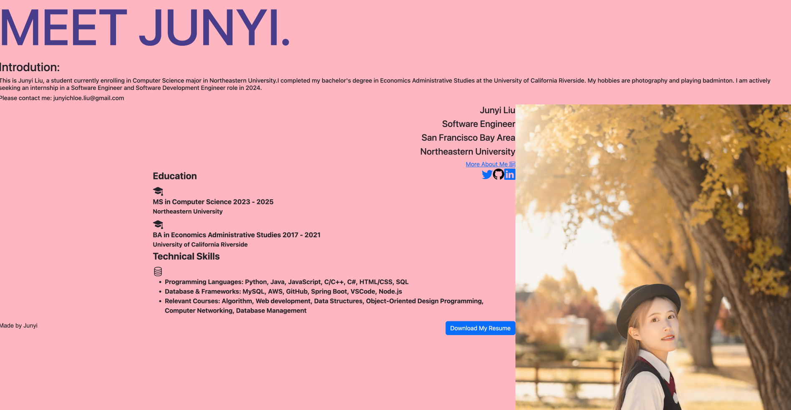
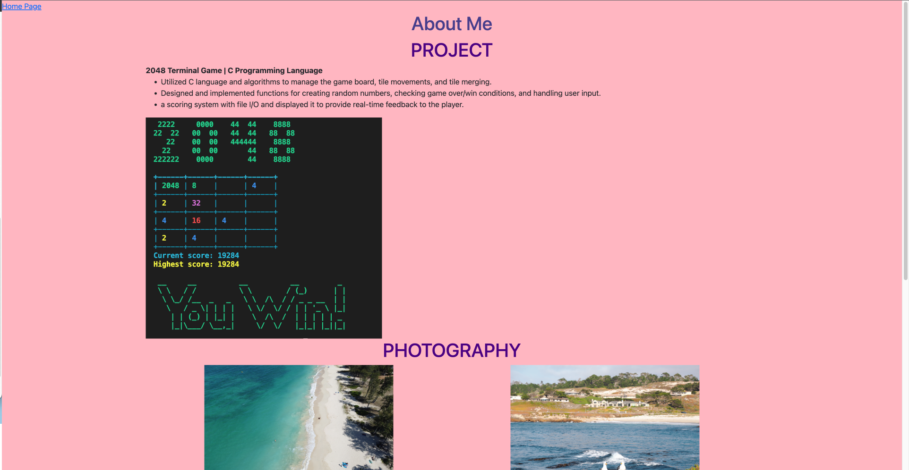

# JunyiLiu-Personal-Website

## Authors

Junyi Liu

## Class  Link:
CS5610: https://johnguerra.co/classes/webDevelopment_fall_2023/

## Project Objective:
This project is a build a personal homepage in the web development class. Using HTML and CSS to build this page.

## Screenshots:

## Instructions:
git clone https://github.com/junnnyiliu/JunyiLiu-Personal-Website.git in terminal
